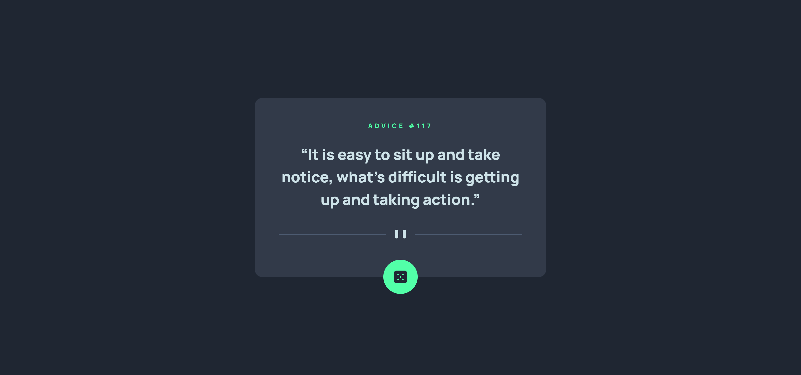

# Frontend Mentor - Advice generator app solution

This is a solution to the [Advice generator app challenge on Frontend Mentor](https://www.frontendmentor.io/challenges/advice-generator-app-QdUG-13db). Frontend Mentor challenges help you improve your coding skills by building realistic projects.

## Table of contents

- [Frontend Mentor - Advice generator app solution](#frontend-mentor---advice-generator-app-solution)
  - [Table of contents](#table-of-contents)
  - [Overview](#overview)
    - [The challenge](#the-challenge)
    - [Screenshot](#screenshot)
    - [Links](#links)
  - [My process](#my-process)
    - [Built with](#built-with)
    - [What I learned](#what-i-learned)
    - [Useful Resources](#useful-resources)
  - [Author](#author)

## Overview

### The challenge

Users should be able to:

- View the optimal layout for the app depending on their device's screen size
- See hover states for all interactive elements on the page
- Generate a new piece of advice by clicking the dice icon

### Screenshot

### Links

- Solution URL: [https://github.com/ShrutiShinde418/advice-generator-app](https://github.com/ShrutiShinde418/advice-generator-app)
- Live Site URL: [http://advice-generator-app-weld.vercel.app/](http://advice-generator-app-weld.vercel.app/)

## My process

### Built with

- Semantic HTML5
- Tailwind CSS

### What I learned

- Fetching data using an API

### Useful Resources

- [Referrer and cache control APIs for fetch()](https://hacks.mozilla.org/2016/03/referrer-and-cache-control-apis-for-fetch/)

## Author

- Frontend Mentor - [@ShrutiShinde418](https://www.frontendmentor.io/profile/ShrutiShinde418)